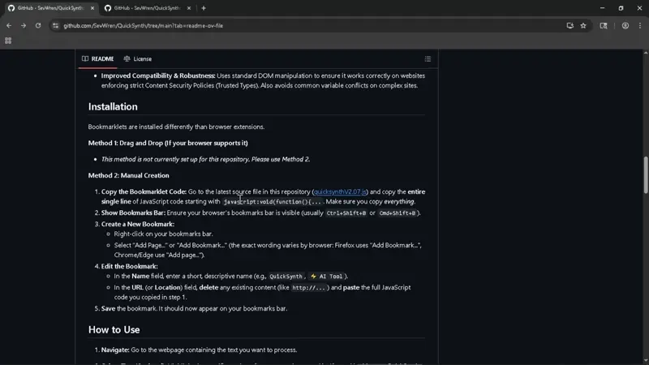
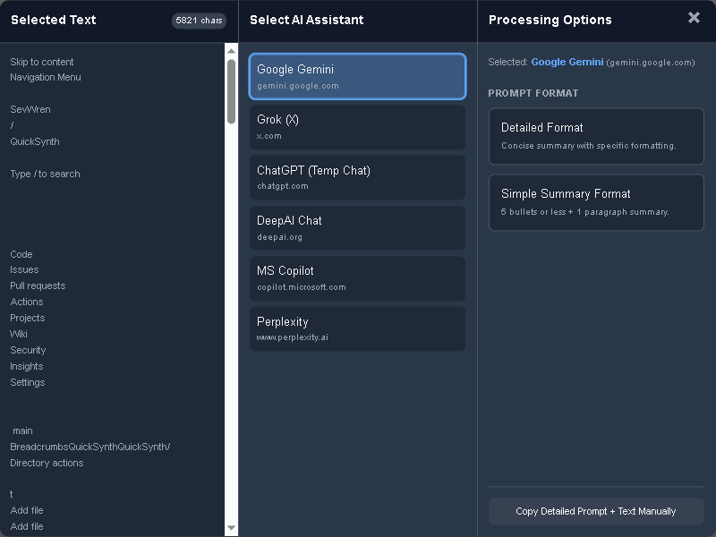

# QuickSynth Bookmarklet

**Author:** [SevWren](https://github.com/SevWren)  
**Repository:** [SevWren/QuickSynth](https://github.com/SevWren/QuickSynth)  
**License:** [Creative Commons Attribution-NonCommercial 4.0 International (CC BY-NC 4.0)](https://github.com/SevWren/QuickSynth/blob/main/LICENSE)

---

## Overview

QuickSynth is a browser bookmarklet designed to streamline the process of sending text
from ANY webpage (or the entire page's text content if no text is selected) to various AI chat
platforms. The text to be sent is displayed in an editable area, bundles your
text with one of several pre-defined prompts, includes the source URL of the webpage for context, and copies the
combined content to your clipboard before opening the chosen AI service's website in a new tab.
The entire process is a bookmark click, a confirmation mouse click, and ctrl-v. That simple.  

This allows for quick analysis, summarization, translation, or reformatting of web content using your preferred AI tool, with consistent instructions, source context, and the ability to refine the text beforehand.

## Features

*   **Text Selection:** Automatically grabs **selected text** OR **all text**.
*   **Editable Text Area:** Displays the editable captured text in the popup, allowing you to modify before processing. *Rare*, but on **occasion** sites will contain enough hidden text that can affect a LLM's response when summarizing.  *(New in v2.05)*
*   **AI Selection UI:** Presents a clean, dark-themed gui popup (see screenshot). "ChatGPT (Temp Chat)" is selected by default.
*   **Prompt Formatting Options:** System prompts for different tasks:
    *   **Detailed Format:** Aims for a concise summary with specific formatting rules (simple sentences, bullets, bolding, italics), still allows for a more detailed response than simple summary format.
    *   **Simple Summary Format:** Creates a short summary (5 bullets or less + 1 paragraph).
    *   **Translate to English:** Instructs the AI to translate the provided text into English.
*   **Source URL Context:** Automatically extracts current URL of the source webpage and inserts it into the final contents copied to the clipboard, providing context to the AI. When combined with a LLM & Web Search, this provides additional context to the AI.
*   **Clipboard Integration:** Copies the processed text (including any manual edits) combined with the chosen system prompt and URL context directly to your clipboard.
*   **Automatic Redirect:** Opens the selected AI service's website in a new tab to paste the contents of your clipboard.
*   **Streamlined Workflow:** No extra confirmation popups after selecting a prompt format; the process is immediate.
*   **Configurable:** The list of AI services and prompts can modified within the bookmarklet code. Default included AIs:
    *   Google Gemini (gemini.google.com/app)
    *   Grok (X) (grok.com)
    *   ChatGPT (Temporary Chat) (chatgpt.com/?temporary-chat=true) **This is the AI option by default for setting tracking disabled via url ability**
    *   ChatGPT (Default Chatgpt Experience) (chatgpt.com)
    *   DeepAI Chat (deepai.org/chat) 
    *   MS Copilot (copilot.microsoft.com)
    *   Perplexity (perplexity.ai)
*   **Error Handling:** Includes basic checks (e.g., prevents multiple popups) and error reporting via console/alerts.
*   **Improved Compatibility & Robustness:**
    Uses standard DOM manipulation to ensure it works correctly on websites enforcing strict Content Security Policies (Trusted Types).
    Also avoids common variable conflicts on complex sites.

## Installation

Bookmarklets are installed differently than browser extensions.

**Method 1: Drag and Drop (If your browser supports it)**

*   *This method is not currently set up for this repository. Please use Method 2.*

**Method 2: Manual Creation**

    

1.  **Copy the Bookmarklet Code:** Go to the latest source file in this repository ([quicksynth_bookmarklet_V2.08.js](https://raw.githubusercontent.com/SevWren/QuickSynth/refs/heads/main/quicksynth_bookmarklet_V2.08.js)) and copy the **entire single line** of JavaScript code starting with `javascript:void(function(){...`. Make sure you copy *everything*.
2.  **Show Bookmarks Bar:** Ensure your browser's bookmarks bar is visible (usually `Ctrl+Shift+B` or `Cmd+Shift+B`).
3.  **Create a New Bookmark:**
    *   Right-click on your bookmarks bar.
    *   Select "Add Page..." or "Add Bookmark..." (the exact wording varies by browser: Firefox uses "Add Bookmark...", Chrome/Edge use "Add page...").
4.  **Edit the Bookmark:**
    *   In the **Name** field, enter a short, descriptive name (e.g., `QuickSynth`, `⚡️ AI Tool`).
    *   In the **URL** (or **Location**) field, **delete** any existing content (like `http://...`) and **paste** the full JavaScript code you copied in step 1.
5.  **Save** the bookmark. It should now appear on your bookmarks bar.

## How to Use

1.  **Navigate:** Go to the webpage containing the text you want to process.
2.  **Select Text (Optional):** Highlight the specific portion of text you are interested in. If you skip this step, QuickSynth will try to use the entire page content.
3.  **Click the Bookmarklet:** Click the `QuickSynth` bookmark you created in your bookmarks bar.
4.  **UI Appears:** A popup menu will appear overlaying the page.
    
    *(Note: Screenshot shows general layout; UI text/options might slightly differ based on updates)*
5.  **Edit Text (Optional):** The captured text appears in the left-most pane. You can now click into this area and edit, delete, or add text as needed before proceeding.
6.  **Choose AI:** "ChatGPT (Temp Chat)" will be selected by default. You can click on the name of a different AI service (like "ChatGPT (Normal)" or others) if desired. The selected AI will be highlighted.
7.  **Choose Format:** Click on the desired prompt format button ("Detailed Format", "Simple Summary Format", or "Translate to English").
8.  **Action:**
    *   The **edited text** from the text area, combined with the chosen prompt and the source page's URL context, will be copied to your clipboard.
    *   A new browser tab will automatically open to the URL of the AI service you selected.
    *   The popup on the original page will close immediately.
    *   *Note:* Your browser might ask for permission to allow the site to access your clipboard, especially the first time or in incognito mode. You need to allow this for the bookmarklet to function correctly.
9.  **Paste:** Once the AI chat interface loads in the new tab, simply paste (`Ctrl+V` or `Cmd+V`) the content from your clipboard into the input field and submit it. The AI will receive the prompt instructions, the source URL context, and the (potentially edited) text itself.

## Customization

You can modify the bookmarklet code directly (before creating the bookmark) to:

*   **Change AI Services:** Edit the `e` array (variable holding the list of AI objects) to add, remove, or modify the names and URLs. This is how "ChatGPT (Normal)" was added.
*   **Modify Prompts:** Edit the `l` (Detailed Format), `n` (Simple Summary), or `z` (Translate to English) variables to change the system instructions sent to the AI. Remember that special characters in prompts need to be URL-encoded (e.g., `%27` for an apostrophe, `%0A` for a newline if not using template literals).
*   **Adjust Styling:** Modify the `s` object (variable holding style definitions like colors, padding, font sizes) to change the appearance of the popup. This now includes styling for the `<textarea>` element as well.

**Important:** After making edits, the entire code must still be on a **single line** starting with `javascript:` to work as a bookmarklet. You might want to use an online JavaScript minifier/compressor tool like <www.toptal.com/developers/javascript-minifier> after making changes, or use an AI assistant with a prompt like: "Minify the following code:': 

---

## TODO / Future Ideas

This section lists potential improvements and features for future versions:

*   **User-Friendly Customization & Bookmarklet Generation:**
    *   Implement a feature (perhaps within the popup UI itself, or via a separate configuration page/tool) allowing users to easily add/edit/remove AI services (Name, URL).
    *   This tool should then **generate the complete, updated, single-line bookmarklet JavaScript code** incorporating the user's custom list. The user could then copy this generated code to create or update their personal bookmarklet, avoiding manual code editing.
*   **Custom Prompts:** Allow users to define and select their own custom prompts in addition to the defaults. Possibly via Github Webapp
*   **UI Themes:** Offer different color themes (e.g., light mode).
*   **Persistence:** Remember the last used AI and/or prompt format (potentially using `localStorage`, though this might be tricky/undesirable for a simple bookmarklet).
*   **Advanced Text Extraction:** Improve handling of complex pages, iframes, or specific content types.
*   **Dynamic Char Count:** The character count now updates in real-time as you edit the text in the text area.
*   ~~**Direct API Integration (Advanced):** Explore possibilities for directly interacting with AI APIs if available (this would likely require a different approach, possibly a browser extension instead of a bookmarklet, due to security and complexity).~~

---
## BUGS / Known Issues

- **Platform Compatibility**: This bookmarklet is currently only confirmed to work on Windows 10. Mobile platforms (iOS/Android) prohibit automated clipboard access, which is required for this tool to function.

Please report any issues you find to the [Issues](https://github.com/QuickSynth/QuickSynth/issues) page.

## Changelog

### v2.08 - 2025-05-31
*   **Fix:** Fixed real-time character count to properly update as you type in the text area
*   **UI/UX:** Improved the visual feedback when hovering over interactive elements
*   **Code Quality:** Enhanced JSDoc comments and code organization

### v2.07 - 2025-04-28
*   **Feature:** Added "ChatGPT (Normal)" option (`https://chatgpt.com/`) to the AI selection list, appearing below "ChatGPT (Temp Chat)". Updated the `e` array in the script.
*   **Fix:** 2025/5/28 Updated the Grok Url, additional readme enhancements & enhanced JSDoc comments

### v2.05 - 2024-04-21
*   **Feature:** Made the "Selected Text" area editable within the popup. Users can now modify or trim the captured text directly in the popup before sending it to the AI.
*   **Change:** Updated the manual copy button and its confirmation alert to refer to "Edited Text".
*   **Change:** Clarified the character count label as "chars (original)".
*   **Internal:** Replaced the text display `
` with a styled `<textarea>` and updated logic to copy the edited text.
*   **Fix:** Corrected encoding for backticks around the source URL in the copied prompt context.

### v2.06 - 2025-04-20
*   Minor internal code refinements and version bump. (No major user-facing feature changes compared to v2.05).

*(Previous versions omitted for brevity)*

---

## Feedback & Bug Reports

Your feedback is valuable in improving QuickSynth! You can help by:
- Reporting any bugs you encounter via issues or the google form below.
📝 [Submit your experience here](https://forms.gle/8emHcPaofcFx4Sck8)

## License

This project is licensed under the **Creative Commons Attribution-NonCommercial 4.0 International License (CC BY-NC 4.0)**.

[![CC BY-NC 4.0][cc-by-nc-shield]][cc-by-nc]

This means:

*   **Attribution (BY):** You must give appropriate credit if you share or adapt this work.
*   **NonCommercial (NC):** You may **not** use this work for commercial purposes.

In simple terms: **You can use, copy, and modify this work as long as you give attribution and you are not using it in a commercial product or for comercial gain.**

Please see the [LICENSE](https://github.com/SevWren/QuickSynth/blob/main/LICENSE) file for the full legal text.

[cc-by-nc]: https://creativecommons.org/licenses/by-nc/4.0/
[cc-by-nc-shield]: https://licensebuttons.net/l/by-nc/4.0/88x31.png