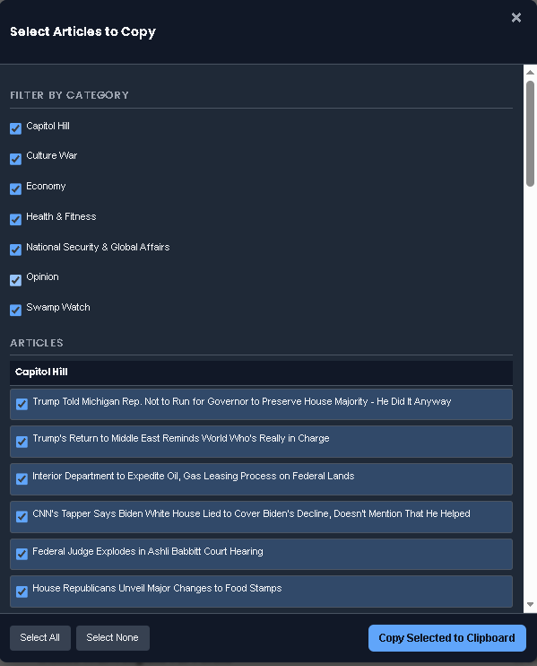

# Bongino Report News Aggregator Script

## Overview
This repository contains JavaScript bookmarklets designed to extract article titles and URLs from the "all-stories" section of the Bongino Report website. The scripts are intended to streamline the process of gathering and summarizing news articles for further processing.

## Features
- Extracts article titles and URLs from the "all-stories" section of the Bongino Report website.
- Skips articles categorized under "Entertainment" and "Sports."
- Formats the extracted data for easy processing.
- Copies the extracted data to the clipboard for use in other tools or workflows.

## Files
### `bongino_extractor_system_prompt_V0.05.js`
- A script that extracts article data and formats it with a detailed system prompt for summarization tasks.
- Includes a popup interface with:
  - Category filters to show or hide articles by category.
  - "Select All" and "Select None" buttons for bulk selection.
  - live preview of selected articles.
- Allows copying selected articles to the clipboard with a system prompt for summarization.

### `bongino_extractor_system_prompt.bookmarklet_V0.05.js`
- A minified version of [`bongino_extractor_system_prompt.bookmarklet_V0.05.js`](bongino_extractor_system_prompt.bookmarklet_V0.05.js) for use as a bookmarklet.
## Setup
1. Open the Bongino Report website in your browser.
2. Add the desired script as a bookmarklet:
   - Copy the contents of the `.bookmarklet.js` file.
   - Create a new bookmark in your browser and paste the script into the URL field.

## Usage
1. Click the bookmarklet while on the Bongino Report website.
2. The script will extract article data and display the articles in a popup interface.
3. Use the category filters and selection controls to choose articles.
4. Click "Copy Selected to Clipboard" to copy the selected articles with the system prompt appended.
5. Paste the copied data into your desired tool or workflow.
> **Note:** The basic version of grok3 works best. Do not use DeepSearch.

## System Prompt (for `bongino_extractor_system_prompt_V0.05.js`)
The extracted data includes a system prompt for summarizing articles. The prompt instructs the user or an AI system to:
1. Access each article URL.
2. Retrieve the full content of the article.
3. Generate a concise summary of the article's main points.
4. Handle inaccessible URLs gracefully by providing an error note.

## Notes
- Ensure you are running the bookmarklet from https://bonginoreport.com.
- The scripts are designed specifically for the Bongino Report website.
- The text copied to the clipboard works best with the Grok LLM (https://grok.com/).
- DeeperSearch does not need to be enabled.

## Disclaimer
These scripts are provided as-is and are intended for personal use. The authors are not affiliated with the Bongino Report website. Use them responsibly and at your own risk.
